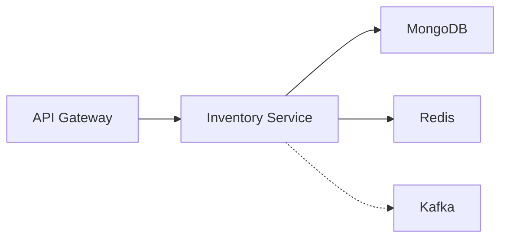

# Inventory Service Documentation

> [!info] Service Overview
> Spring Boot microservice for ERP inventory management. MongoDB-backed, Eureka client. Part of [[ERP_Project_Documentation|ERP Microservices Architecture]].

## Tech Stack

| Component | Technology |
|-----------|------------|
| Framework | Spring Boot 4.0.6 |
| Language | Java 21 |
| Database | MongoDB |
| Service Discovery | Netflix Eureka Client |
| Validation | Jakarta Bean Validation |
| Build Tool | Maven |
| Caching | Redis (planned) |

## Architecture Position



See: [[ERP_Project_Documentation#^architecture|ERP Architecture Overview]]

## Entity Model
 
### Inventory

Location: `src/main/java/com/Chan/InventoryService/Entity/Inventory.java`

| Field | Type | Constraints |
|-------|------|-------------|
| `id` | String | @Id (auto-generated) |
| `productId` | String | Unique, indexed, format `^PROD-[0-9]{3}$` |
| `productName` | String | 2-100 characters |
| `quantity` | int | 0 - 100,000 |
| `price` | double | 0.1 - 999,999.99 |
| `location` | String | 2-100 characters |
| `createdAt` | LocalDateTime | @CreatedDate |
| `updatedAt` | LocalDateTime | @LastModifiedDate |
| `instock` | Boolean | availability flag |

## API Contract

> [!warning] Implementation Status
> **CRITICAL:** No `@RestController` found in codebase. Service layer exists but HTTP endpoints NOT implemented. See: [[#Known Issues]]

### Expected Endpoints (from [[ERP_Project_Documentation|ERP Docs]])

| Method | Path | Description |
|--------|------|-------------|
| GET | `/api/inventory` | List all inventory items |
| GET | `/api/inventory/{id}` | Get item by ID |
| GET | `/api/inventory/product/{productId}` | Get by product ID |
| POST | `/api/inventory` | Create new inventory item |
| PUT | `/api/inventory/{id}` | Update inventory item |
| DELETE | `/api/inventory/{id}` | Delete inventory item |
| PATCH | `/api/inventory/{id}/stock` | Update stock quantity |
| GET | `/api/inventory/low-stock` | Get low stock items |

## Repository Layer

Location: `src/main/java/com/Chan/InventoryService/Repository/InventoryRepository.java`

```java
public interface InventoryRepository extends MongoRepository<Inventory, String> {
    Optional<Inventory> findByProductId(String productId);
    boolean existsByProductId(String productId);
    List<Inventory> findByLocation(String location);
    List<Inventory> findByQuantityLessThan(int quantity);
    void deleteByProductId(String productId);
}
```

## Service Layer

Location: `src/main/java/com/Chan/InventoryService/Service/InventoryService.java`

> [!bug] Incomplete Implementation
> Service class exists but contains ONLY the `maptoResponse()` method. No CRUD operations implemented.

### Expected Methods (not implemented)
- `getAllInventory()`
- `getInventoryById(String id)`
- `getInventoryByProductId(String productId)`
- `createInventory(InventoryRequest request)`
- `updateInventory(String id, InventoryRequest request)`
- `deleteInventory(String id)`
- `updateStock(String id, int quantity)`
- `getLowStockItems()`

## Validation Rules

Location: `src/main/java/com/Chan/InventoryService/DataTransferObjects/InventoryRequest.java`

### InventoryRequest DTO

| Field | Validation |
|-------|------------|
| `productId` | Required, format `PROD-XXX` (e.g., `PROD-001`) |
| `productName` | Required, 2-100 characters |
| `quantity` | Required, 0-100,000 |
| `price` | Required, 0.1-999,999.99, max 6 integer + 2 decimal |
| `location` | Required, 2-100 characters |

## Error Handling

Location: `src/main/java/com/Chan/InventoryService/Exceptions/GlobalExceptionHandler.java`

### Exception Mappings

| Exception | HTTP Status | Response |
|-----------|-------------|----------|
| ResourceNotFoundException | 404 | ErrorResponse |
| Exception (catch-all) | 404 | ErrorResponse |

### ErrorResponse DTO

```json
{
  "statusCode": 404,
  "message": "string",
  "timestamp": "LocalDateTime"
}
```

## Dependencies

From `pom.xml`:

```xml
spring-boot-starter-data-mongodb
spring-boot-starter-validation
spring-boot-starter-webmvc
spring-cloud-starter-netflix-eureka-client
lombok
```

## Configuration

MongoDB connection configured in `src/main/resources/application.properties`

## Known Issues

> [!todo] Required Work
> 1. **Create InventoryController** - No REST controller exists
> 2. **Implement CRUD methods in InventoryService** - Only mapper exists
> 3. **Add Kafka producer** - Mentioned in ERP docs but not implemented
> 4. **Add Redis caching** - Mentioned in ERP docs but not configured

## Related Services

- [[ERP_Project_Documentation#^auth|Auth Service]] - JWT authentication
- [[ERP_Project_Documentation#^employee|Employee Service]] - Employee management
- [[ERP_Project_Documentation#^payroll|Payroll Service]] - Payroll processing
- [[ERP_Project_Documentation#^report|Report Service]] - GraphQL reporting
- [[ERP_Project_Documentation#^notification|Notification Service]] - Go-based notifications
